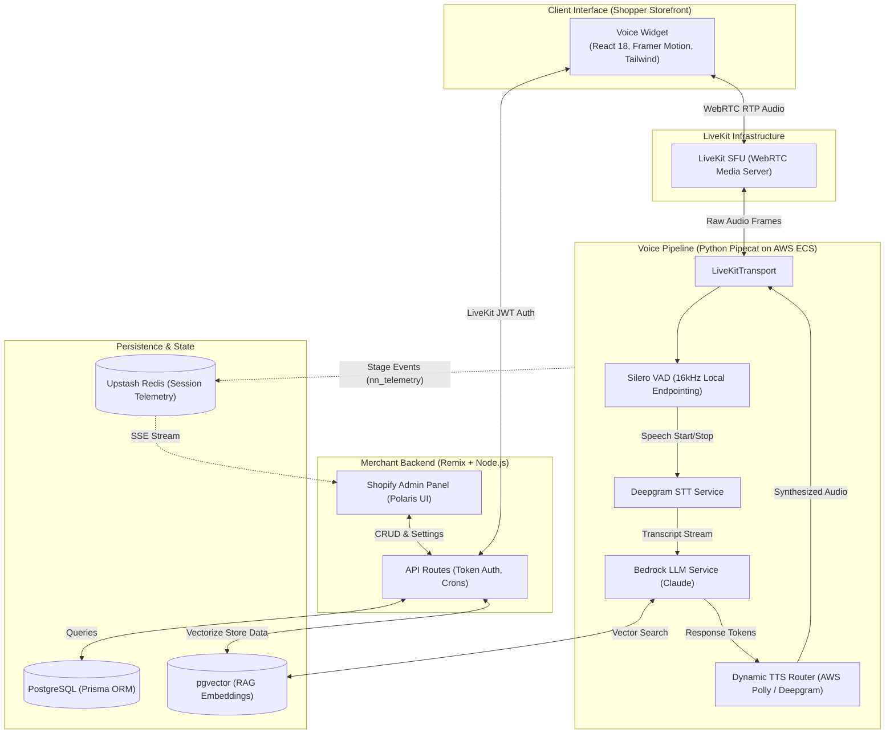

# Shopkeeper AI – Enterprise Voice Commerce Agent

> **A highly scalable AI Voice Agent that integrates into any website or e-commerce platform via a lightweight widget. Built with WebRTC (LiveKit), Pipecat, AWS Bedrock, and a pgvector RAG architecture to deliver low-latency conversational commerce.**

**Live Website Integration:** [atlowest.com](https://atlowest.com)  
**Shopify App Store:** [Shopkeeper Voice Agent](https://apps.shopify.com/shopkeeper-2)

---

## The Plug-and-Play Widget

Embedding the voice agent requires adding a single script tag to any website. Once launched, it establishes a persistent WebRTC connection to the LiveKit backend, allowing users to talk directly to the AI to find products, get recommendations, and check order statuses.

<div align="center">
  
</div>

---

## Deep Dive: System Architecture & Integration

This architecture reflects a production-grade deployment spanning multiple repositories, languages, and specialized AI infrastructure.

### 1. Client-Side: React Voice Widget (Vite + LiveKit)
Unlike typical chat widgets, the client is built for real-time bidirectional audio.
* **Tech Stack**: React 18, Framer Motion (for fluid UI animations), TailwindCSS, and `@livekit/components-react`.
* **Bundling**: The React widget is bundled via Vite and Esbuild into a single, optimized script file that can be injected into any Shopify theme or external website without causing CSS conflicts.
* **Audio Transport**: Uses the LiveKit Client SDK to establish a peer-to-peer WebRTC connection to the backend media server.

### 2. Backend API & Merchant Dashboard (Remix + Node.js)
The core web backend is a full-stack Remix application serving both the Shopify Admin interface and secure API endpoints.
* **Widget Tokenization**: Generates secure JWTs for LiveKit (`api.widget-token.tsx`), ensuring only authorized storefronts can initiate voice sessions.
* **Data Persistence**: Uses **Prisma ORM** to connect to the primary **PostgreSQL** database.
* **Background Jobs**: Automated cron jobs (`api.cron.*`) handle session pruning, ticket expiry, and voice analytics aggregation.

### 3. Real-time Voice Pipeline (Python / Pipecat)
The voice AI is orchestrated by a Python-based state machine using the **Pipecat** framework, deployed on AWS ECS. It uses a custom-built concurrent pipeline:
* **Transport**: `LiveKitTransport` ingests raw WebRTC audio frames directly from the user's browser.
* **VAD (Layer 1)**: `SileroVADAnalyzer` (running locally at 16kHz) performs Voice Activity Detection to intelligently chunk human speech and instantly detect barge-ins (interruptions).
* **STT**: `DeepgramSTTService` handles streaming Speech-to-Text transcription.
* **LLM**: A customized `BedrockLLMService` interfaces with Anthropic's Claude models on AWS Bedrock, maintaining conversational memory and streaming token generation.
* **TTS Router**: A `DynamicMultilingualTTSService` routes generated text dynamically to either **AWS Polly** or **Deepgram TTS** depending on language and latency requirements, streaming audio back to LiveKit before the sentence generation is finished.

### 4. RAG & Vector Database (PostgreSQL + pgvector)
To prevent hallucination and ensure the AI accurately references inventory and store policies, a Vector-driven RAG architecture is implemented.
* **Embeddings**: Store data is embedded and stored directly in Postgres using the **`pgvector`** extension (`embedding Unsupported("vector")?` in Prisma).
* **Context Injection**: During the LLM phase, user intent is vectorized and matched against the `pgvector` store using Cosine Similarity, dynamically injecting relevant data into the Bedrock prompt schema.

### 5. Neural Network Telemetry (Upstash Redis)
A custom, zero-AWS-cost telemetry emitter (`nn_telemetry.py`) was built inside the Pipecat agent. 
* Every key pipeline stage (VAD trigger, LLM Thinking, TTS generation, tool execution) emits a lightweight event to **Upstash Redis**.
* The Remix Merchant Dashboard subscribes to these Redis events via Server-Sent Events (SSE), rendering a live visualization of active voice sessions in real-time.

---

## Core AI/ML Concepts & Skills Demonstrated

This project is a comprehensive showcase of modern AI engineering, applying machine learning and software engineering principles to a production environment. 

* **Python & Agent Frameworks**: The core real-time pipeline is built entirely in **Python**, utilizing the **Pipecat** framework to build a robust, state-machine driven **AI Agent** capable of function calling and complex dialogue management.
* **Natural Language Processing (NLP) & Tokenization**: Implements optimized streaming **Speech-to-Text (STT)** and tokenization. As the user speaks, audio is transcribed into text tokens and fed continuously into the LLM context window, maintaining strict semantic coherence.
* **Large Language Models & Transformers**: Driven by **Claude 3.5 (Anthropic)** on AWS Bedrock, an advanced **transformer model**. I utilize **Prompt Engineering** and few-shot classification techniques for precise intent recognition (functioning as dynamic **Named Entity Recognition / NER** and **Text Classification**) directly within the prompt schema.
* **RAG, Vector Databases & Embeddings**: To prevent hallucinations, I built a **Retrieval-Augmented Generation (RAG)** pipeline. I generate **embeddings** of product catalogs and perform **Semantic Search** using **pgvector** in PostgreSQL (acting as the **Vector Database**) to retrieve context before generating a response.
* **Machine Learning Fundamentals (VAD)**: Utilizes **Silero VAD**, a **PyTorch**-based machine learning model, running locally at 16kHz to perform Voice Activity Detection. This handles complex **Data Structures & Algorithms** (like ring buffers and event queues) to detect barge-ins and end-of-utterance with high precision.
* **MLOps, CI/CD & Telemetry**: The entire backend is containerized via **Docker** and deployed on AWS ECS (utilizing core **Kubernetes** concepts). For **ML experiment tracking** and observability, I built a custom telemetry emitter that pushes inference times and stage latencies directly to Redis.
* **Database & APIs**: The full-stack Remix application exposes secure **REST APIs**, utilizing Prisma ORM for **SQL** relational queries alongside vector searches.

---

## System Architecture Diagram



---

## Code Sample


```python
# Abstracted representation of the Pipecat Pipeline (agent.py)
import asyncio
from pipecat.pipeline.pipeline import Pipeline
from pipecat.pipeline.task import PipelineTask
from pipecat.transports.livekit.transport import LiveKitTransport
from pipecat.audio.vad.silero import SileroVADAnalyzer
from pipecat.services.deepgram.stt import DeepgramSTTService

from llm_bedrock import BedrockLLMService
from tts_router import get_tts_service
import nn_telemetry as telemetry

async def main():
    # 1. Initialize WebRTC Transport
    transport = LiveKitTransport(room_name="session-uuid", token="<jwt>")
    
    # 2. Initialize VAD (Silero at 16kHz)
    vad_analyzer = SileroVADAnalyzer(sample_rate=16000)
    
    # 3. Initialize AI Services
    stt = DeepgramSTTService(settings=DeepgramSTTService.Settings(audio_in_sample_rate=16000))
    llm = BedrockLLMService()
    tts = get_tts_service(lang_code="en-US", voice_speaker="ritu")
    
    # 4. Construct Pipecat Pipeline
    pipeline = Pipeline([
        transport.input(),    # WebRTC Audio In
        vad_analyzer,         # Endpointing & Barge-in detection
        stt,                  # Deepgram STT
        llm,                  # Claude / AWS Bedrock (with RAG injection)
        tts,                  # Dynamic TTS (Polly/Deepgram)
        transport.output()    # WebRTC Audio Out
    ])
    
    task = PipelineTask(pipeline)
    
    @transport.event_handler("on_participant_connected")
    async def on_connected(participant):
        telemetry.session_started("session-uuid")
        print(f"Shopper connected via LiveKit.")
        
    await task.run()

if __name__ == "__main__":
    asyncio.run(main())
```
