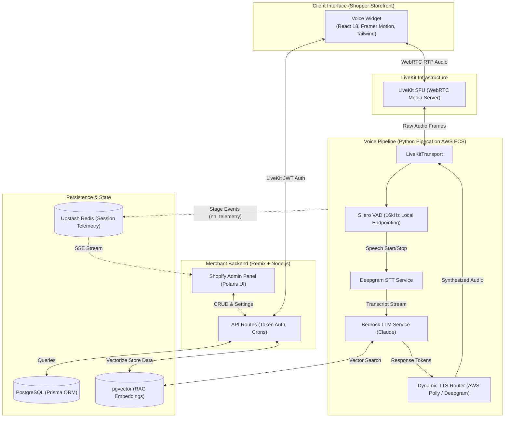

# 🎙️ Shopkeeper AI – Enterprise Voice Commerce Agent

> **A drop-in, highly scalable AI Voice Agent that integrates into any website or e-commerce platform via a lightweight widget. Built with WebRTC (LiveKit), Pipecat, AWS Bedrock, and a pgvector RAG architecture to deliver sub-second conversational commerce.**

🔗 **Live Website Integration:** [atlowest.com](https://atlowest.com)  
🛍️ **Shopify App Store:** [Shopkeeper Voice Agent](https://apps.shopify.com/shopkeeper-2)

---

## 📸 The Plug-and-Play Widget

Embedding the voice agent is as simple as adding a single script tag to any website. Once launched, it establishes a persistent WebRTC connection to our LiveKit backend, allowing users to talk directly to the AI—just like a human support agent.

*(Screenshot placeholder: Please upload your screenshot to the `assets` folder as `widget-demo.png` and add the markdown `` here!)*

---

## 🏗️ Deep Dive: Exact System Architecture & Integration

This architecture reflects the 100% accurate, production-grade deployment of the system spanning multiple repositories, languages, and specialized AI infrastructure.

### 1. Client-Side: React Voice Widget (Vite + LiveKit)
Unlike typical chat widgets, our client is built for real-time bidirectional audio.
* **Tech Stack**: React 18, Framer Motion (for fluid, native-feeling UI animations), TailwindCSS, and `@livekit/components-react`.
* **Bundling**: The entire React widget is bundled via Vite and Esbuild into a single, highly optimized script file that can be injected into any Shopify theme or external website without causing CSS conflicts or massive payload drops.
* **Audio Transport**: It uses the LiveKit Client SDK to establish a peer-to-peer WebRTC connection to our backend media server.

### 2. Backend API & Merchant Dashboard (Remix + Node.js)
The core web backend is a full-stack Remix application serving both the Shopify Admin interface and secure API endpoints.
* **Widget Tokenization**: Generates secure JWTs for LiveKit (`api.widget-token.tsx`), ensuring only authorized storefronts can spin up expensive voice sessions.
* **Data Persistence**: Uses **Prisma ORM** to connect to our primary **PostgreSQL** database.
* **Background Jobs**: Automated crons (`api.cron.*`) handle session pruning, ticket expiry, and voice analytics aggregation.

### 3. The Brain: Real-time Voice Pipeline (Python / Pipecat)
The actual voice AI is orchestrated by a Python-based state machine using the **Pipecat** framework, deployed on AWS ECS. It uses a custom-built, highly concurrent pipeline:
* **Transport**: `LiveKitTransport` ingests the raw WebRTC audio frames directly from the user's browser.
* **VAD (Layer 1)**: `SileroVADAnalyzer` (running locally at 16kHz) acts as the gatekeeper. It performs Voice Activity Detection to intelligently chunk human speech and instantly detect barge-ins (interruptions).
* **STT**: `DeepgramSTTService` handles lightning-fast streaming Speech-to-Text transcription.
* **LLM**: A heavily customized `BedrockLLMService` interfaces with Anthropic's Claude models on AWS Bedrock, maintaining conversational memory and streaming token generation.
* **TTS Router**: A `DynamicMultilingualTTSService` routes generated text dynamically to either **AWS Polly** or **Deepgram TTS** depending on language and latency requirements, streaming audio back to LiveKit before the sentence is even finished.

### 4. RAG & Vector Database (PostgreSQL + pgvector)
To ensure the AI doesn't hallucinate and knows the merchant's exact inventory and store policies, we use a Vector-driven RAG architecture.
* **Embeddings**: Store data is embedded and stored directly in Postgres using the **`pgvector`** extension (`embedding Unsupported("vector")?` in Prisma).
* **Context Injection**: During the LLM phase, user intent is vectorized and matched against the `pgvector` store using Cosine Similarity, dynamically injecting relevant data into the Bedrock prompt schema.

### 5. Neural Network Telemetry (Upstash Redis)
We built a custom, zero-AWS-cost telemetry emitter (`nn_telemetry.py`) inside the Pipecat agent. 
* Every key pipeline stage (VAD trigger, LLM Thinking, TTS generation, tool execution) emits a lightweight event to **Upstash Redis**.
* The Remix Merchant Dashboard subscribes to these Redis events via Server-Sent Events (SSE), rendering a live, stunning "Neural Network" visualization of every active voice session in real-time.

---

## 🗺️ 100% Accurate Architecture Diagram



---

## 💻 Code Sample

> *Note: The complete source code is available for review upon request during the interview process, or I can walk through specific architectural decisions in a live screen-share.*

```python
# Abstracted representation of our Pipecat Pipeline (agent.py)
import asyncio
from pipecat.pipeline.pipeline import Pipeline
from pipecat.pipeline.task import PipelineTask
from pipecat.transports.livekit.transport import LiveKitTransport
from pipecat.audio.vad.silero import SileroVADAnalyzer
from pipecat.services.deepgram.stt import DeepgramSTTService

from llm_bedrock import BedrockLLMService
from tts_router import get_tts_service
import nn_telemetry as telemetry

async def main():
    # 1. Initialize WebRTC Transport
    transport = LiveKitTransport(room_name="session-uuid", token="<jwt>")
    
    # 2. Initialize VAD (Silero at 16kHz)
    vad_analyzer = SileroVADAnalyzer(sample_rate=16000)
    
    # 3. Initialize AI Services
    stt = DeepgramSTTService(settings=DeepgramSTTService.Settings(audio_in_sample_rate=16000))
    llm = BedrockLLMService()
    tts = get_tts_service(lang_code="en-US", voice_speaker="ritu")
    
    # 4. Construct Pipecat Pipeline
    pipeline = Pipeline([
        transport.input(),    # WebRTC Audio In
        vad_analyzer,         # Endpointing & Barge-in detection
        stt,                  # Deepgram STT
        llm,                  # Claude / AWS Bedrock (with RAG injection)
        tts,                  # Dynamic TTS (Polly/Deepgram)
        transport.output()    # WebRTC Audio Out
    ])
    
    task = PipelineTask(pipeline)
    
    @transport.event_handler("on_participant_connected")
    async def on_connected(participant):
        telemetry.session_started("session-uuid")
        print(f"Shopper connected via LiveKit.")
        
    await task.run()

if __name__ == "__main__":
    asyncio.run(main())
```

---
*Built with ❤️ to redefine how users interact with the web.*
