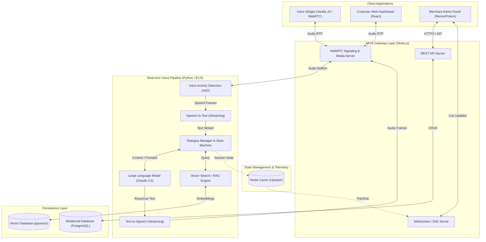

# Shopkeeper AI – Enterprise Voice Commerce Agent

> **An AI-powered voice assistant and Shopify app that enables conversational commerce for merchants, built with real-time AI voice pipelines and a robust React/Remix dashboard.**

---

## 📌 Project Overview
Shopkeeper AI is a comprehensive enterprise solution that brings real-time, human-like voice AI to Shopify storefronts. It consists of two main components:
1. **Shopper-Facing Voice Widget**: A lightweight, frictionless widget embedded directly into Shopify storefronts, allowing customers to talk to an AI agent for product discovery, support, and order tracking.
2. **Merchant Dashboard (Shopify App)**: A full-featured Shopify Admin application where merchants can configure their agent's personality, train its knowledge base, view real-time conversation analytics, and manage billing.

---

## 🏗 Architecture & Tech Stack

### Tech Stack
* **Frontend (Merchant Dashboard)**: Remix, React, TypeScript, Shopify Polaris (Vanilla CSS)
* **Frontend (Voice Widget)**: Plain JavaScript (zero-dependency for maximum performance)
* **Backend & API**: Node.js, DuckDB / Postgres (Prisma)
* **AI & Real-Time Pipeline**: Pipecat (Python), AWS Bedrock (Claude 3.5 Sonnet), WebRTC for low-latency audio
* **Infrastructure & Hosting**: Fully deployed on AWS (ECS, App Runner, S3)
* **Telemetry**: Upstash Redis for real-time visualization state

### Architecture Diagram


---

## ✨ Key Features

1. **Ultra-Low Latency Voice Pipeline**
   - Built on a highly optimized Python state machine (Pipecat) to ensure sub-second response times.
   - Streams audio chunks directly to and from AWS Bedrock for seamless conversational flow.

2. **Real-Time Neural Network Dashboard**
   - A stunning, live-updating visual representation of all active voice sessions.
   - Built using zero-AWS-cost Upstash Redis telemetry to visualize STT, LLM, and TTS stages instantly.

3. **Shopify Admin Integration**
   - Deeply integrated into the Shopify ecosystem using `@shopify/polaris` for a native look and feel.
   - Allows merchants to easily upload product FAQs, sync inventory data, and view conversation transcripts.

4. **Widget Portability**
   - The shopper-facing widget is built entirely without heavy frameworks, ensuring it does not impact the host Shopify store's Lighthouse performance scores.

---

## 🔄 Core API Flow (Voice Session)

1. **Initialization**: Shopper clicks the widget; a secure token is negotiated with the backend.
2. **WebRTC Connection**: A peer-to-peer audio connection is established between the browser and the AWS ECS Pipecat container.
3. **Pipeline Execution**:
   - **Listen (STT)**: User speech is transcribed continuously.
   - **Think (LLM)**: AWS Bedrock generates responses based on the merchant's trained prompt schema.
   - **Speak (TTS)**: Response is synthesized and streamed back to the user.
4. **Telemetry Emission**: Throughout the session, lightweight events are pushed to Redis to update the merchant's live dashboard.

---

## 💻 Code Sample

> *Note: Below is an abstracted sample demonstrating the architectural pattern used for the real-time AI pipeline. Proprietary logic and keys have been removed.*

```python
# sample_agent_pipeline.py
import asyncio
from flows import FlowManager, session_started, session_ended
import nn_telemetry as telemetry

class VoicePipeline:
    def __init__(self, session_id, llm_client):
        self.session_id = session_id
        self.llm_client = llm_client
        self.is_active = False

    async def start(self):
        self.is_active = True
        telemetry.session_started(self.session_id)
        
        try:
            while self.is_active:
                user_audio = await self.receive_audio()
                if user_audio:
                    # 1. Speech to Text
                    text = await self.process_stt(user_audio)
                    
                    # 2. LLM Processing (with telemetry)
                    telemetry.stage_llm_thinking(self.session_id)
                    response = await self.llm_client.generate(text)
                    telemetry.stage_llm_done(self.session_id)
                    
                    # 3. Text to Speech
                    await self.process_tts(response)
                    
        finally:
            self.cleanup()

    def cleanup(self):
        self.is_active = False
        telemetry.session_ended(self.session_id)

# The real implementation utilizes asynchronous WebRTC streams, 
# advanced buffering, and dynamic tool execution via AWS Bedrock.
```

---

## 🔒 Source Code

The complete source code is available for review upon request during the interview process, or I can walk through specific architectural decisions in a live screen-share.

---
*Built with ❤️ for modern eCommerce.*
