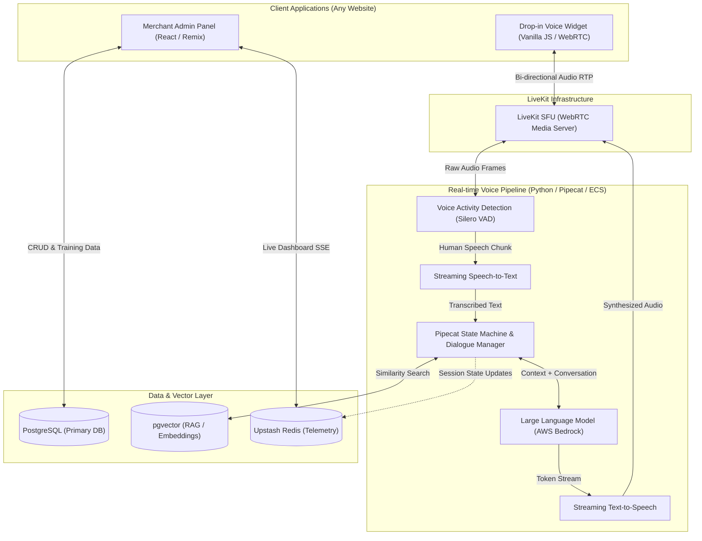

# 🎙️ Enterprise Voice AI Assistant – Real-Time Conversational Commerce

> **A drop-in, highly scalable AI Voice Agent that integrates into any website or e-commerce platform via a lightweight widget. Built with WebRTC, Pipecat, LiveKit, and a Vector-driven RAG architecture to deliver sub-second conversational commerce.**

---

## 📸 The Plug-and-Play Widget

Embedding the voice agent is as simple as adding a single script tag to any website. Once launched, it establishes a persistent WebRTC connection, allowing users to talk directly to the AI—just like a human support agent—to find products, get recommendations, and check order statuses.


---

## 🏗️ Deep Dive: System Architecture & Integration

This project is engineered to solve the hardest problems in real-time Voice AI: **Latency, Interruption Handling, and Contextual Accuracy.** 

### 1. WebRTC & LiveKit Infrastructure
To achieve ultra-low latency, standard HTTP requests are insufficient. We utilize **LiveKit** as our WebRTC media server. 
* **Client-Side**: The Vanilla JS widget captures raw microphone audio and streams it continuously over a WebRTC peer connection.
* **Server-Side**: The audio stream is ingested by our **Pipecat** (Python) worker, which orchestrates the entire AI pipeline in real-time.

### 2. Voice Activity Detection (VAD) & Audio Processing
Before sending audio to transcription, we run a local **Voice Activity Detection (VAD)** model (e.g., Silero VAD) within the Pipecat pipeline.
* **Endpointing**: The VAD intelligently detects when a user starts and stops speaking. 
* **Interruption (Barge-in)**: If the AI is speaking and the user interrupts, the VAD detects the human voice, instantly halts the TTS playback, and flushes the audio buffers, creating a natural, conversational dynamic.

### 3. Speech-to-Text (STT) & Tokenization
Once human speech is detected, the audio frames are streamed to the STT engine.
* Transcribed text is immediately tokenized and appended to the conversational state machine. 
* We optimize tokenization to ensure the LLM's context window contains the most relevant recent dialogue, maintaining fast inference times while preserving context.

### 4. Vector Database & RAG (Retrieval-Augmented Generation)
To ensure the AI doesn't hallucinate and knows the merchant's exact inventory, we use a sophisticated RAG pipeline:
* **Embeddings**: Product catalogs, store policies, and FAQs are embedded into vector representations.
* **pgvector (PostgreSQL)**: We use PostgreSQL with the `pgvector` extension for lightning-fast similarity search (Cosine Similarity/HNSW). 
* **Context Injection**: Before querying the LLM, the user's intent is vectorized, relevant product data is fetched from the database, and injected directly into the LLM's system prompt dynamically.

### 5. Large Language Model (Claude 3.5 / AWS Bedrock)
The conversational brain is powered by Claude 3.5 via AWS Bedrock.
* **Streaming Generation**: The LLM streams its response token-by-token. We do not wait for the full sentence to finish.
* **Tool Calling**: The LLM is equipped with function-calling capabilities to trigger backend actions (e.g., `check_inventory(sku)`, `add_to_cart(id)`).

### 6. Streaming Text-to-Speech (TTS)
As soon as the LLM generates the first few tokens (a phrase or sentence), it is immediately sent to the TTS engine. The synthesized audio is chunked and sent back through the LiveKit WebRTC channel, playing in the user's browser before the LLM has even finished generating the complete thought.

---

## 🗺️ Comprehensive Architecture Diagram



---

## 🚀 Key Differentiators

* **Universal Integration**: Not just for Shopify. The widget is a pure JavaScript snippet that can be injected into **any website**, transforming a static site into a conversational experience instantly.
* **Sub-Second Latency**: By utilizing Pipecat, LiveKit, and streaming APIs at every step (STT -> LLM -> TTS), the perceived latency is nearly identical to speaking with a human.
* **Cost-Efficient Telemetry**: Instead of expensive polling, the system uses Upstash Redis to push live neural-network-style visualizations of active sessions directly to the merchant dashboard in real-time.

---

## 💻 Code Sample

> *Note: The complete source code is available for review upon request during the interview process. Below is an abstracted representation of our Pipecat + LiveKit integration pattern.*

```python
# architecture_sample.py
import asyncio
from pipecat.pipeline.pipeline import Pipeline
from pipecat.pipeline.task import PipelineTask
from pipecat.services.livekit import LiveKitTransport
from pipecat.services.bedrock import BedrockLLMService
from pipecat.services.elevenlabs import ElevenLabsTTSService
from pipecat.services.deepgram import DeepgramSTTService

async def main():
    # 1. Initialize LiveKit WebRTC Transport
    transport = LiveKitTransport(
        room_name="voice-session-123",
        token="<jwt-token>"
    )
    
    # 2. Initialize Core AI Services
    stt = DeepgramSTTService()
    llm = BedrockLLMService(model="anthropic.claude-3-5-sonnet")
    tts = ElevenLabsTTSService()
    
    # 3. Construct the Real-Time RAG + Voice Pipeline
    # Audio IN -> VAD -> STT -> RAG Agent -> LLM -> TTS -> Audio OUT
    pipeline = Pipeline([
        transport.input(),    # Captures WebRTC Audio
        stt,                  # Transcribes to Text
        # [Custom RAG Context Injector Node Here]
        llm,                  # Generates Response Tokens
        tts,                  # Synthesizes Audio
        transport.output()    # Streams back over WebRTC
    ])
    
    task = PipelineTask(pipeline)
    
    @transport.event_handler("on_participant_connected")
    async def on_connected(participant):
        print(f"User {participant.identity} joined. Ready to talk.")
        
    await task.run()

if __name__ == "__main__":
    asyncio.run(main())
```

---
*Built with ❤️ to redefine how users interact with the web.*
